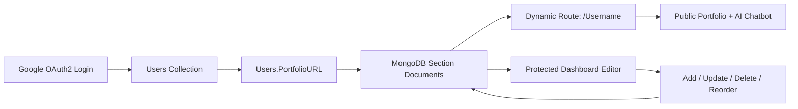

<!-- ===================== GILDED PROFILE HEADER ===================== -->

<div align="center">


[](https://git.io/typing-svg)


<br/><br/>

<a href="https://aaroophan.dev">
  
</a>
<a href="https://linkedin.com/in/Aaroophan">
  
</a>
<a href="https://github.com/Aaroophan">
  
</a>
<a href="https://medium.com/@aaroophan">
  
</a>
<a href="mailto:arophn@gmail.com">
  
</a>

</div>

---

## 🧠 About Me

```ts
const aaroophan = {
  role: "Full Stack Software Engineer",
  focus: [
    "Metadata-driven platforms",
    "Dynamic UI runtimes",
    "No-code portfolio systems",
    "Backend orchestration layers",
    "AI-assisted products",
    "Local LLM and agent workflows"
  ],
  stack: {
    frontend: ["Next.js", "React", "TypeScript", "Redux", "Tailwind CSS", "Framer Motion", "Three.js"],
    backend: ["ASP.NET Core", "Node.js", "FastAPI", "Express", "REST APIs"],
    data: ["SQL Server", "PostgreSQL", "MongoDB", "Redis", "SQLite"],
    ai: ["Groq API", "OpenAI API", "PyTorch", "Local LLMs", "AI Agents"],
    systems: ["Docker", "RabbitMQ", "Jenkins", "Selenium", "Serilog", "OAuth2", "JWT"]
  },
  currentlyBuilding: "HarkDB — SQLite-backed database platform",
  moreInfo: "https://aaroophan.dev/Aaroophan"
}
````

I build configurable software systems where UI, content, permissions, and workflows are driven by data instead of hard-coded screens.
My work spans full-stack engineering, admin platforms, automation, AI-enabled products, local infrastructure, and technical writing.

---

## 🚀 Current Focus

<table>
<tr>
<td width="50%">

### 🧩 Metadata-Driven Platforms

* Dynamic UI rendering from backend schemas
* Configurable admin dashboards
* Reusable CRUD engines
* Permission-aware form systems
* No-code content management flows

</td>
<td width="50%">

### 🤖 AI + Local Systems

* Local LLM experimentation
* AI agents and automation
* Groq / OpenAI API integrations
* FastAPI-based AI services
* Local servers and dev infrastructure

</td>
</tr>
</table>

---

## 🏗️ Featured Research-Build: GildedIn

<div align="center">

<a href="https://github.com/Aaroophan/GildedIn">
  
</a>

</div>

**GildedIn** is a metadata-driven no-code portfolio platform that generates dynamic user portfolio sites through Next.js routes, MongoDB-backed section schemas, Google OAuth2 ownership mapping, protected dashboard editing, nested add/update/delete/reorder workflows, and user-specific Groq-powered AI chatbot context.



**Core stack:** Next.js App Router, TypeScript, React, Redux, MongoDB, Redis, Google OAuth2, Groq API, Tailwind CSS, Framer Motion, Three.js.

---

## 🧰 Engineering Stack

### Frontend Runtime

<p>

</p>

### Backend + API Layer

<p>

</p>

### Data + Messaging

<p>

</p>

### DevOps + Tooling

<p>

</p>

### AI / ML / Creative

<p>

</p>

---

## ⚙️ What I Build

| Area                     | Things I Like Building                                                        |
| ------------------------ | ----------------------------------------------------------------------------- |
| **Platform Engineering** | Metadata-driven systems, configurable dashboards, schema-powered UI runtimes  |
| **Frontend Systems**     | Next.js apps, reusable component engines, animated admin UX, WYSIWYG builders |
| **Backend Systems**      | ASP.NET Core APIs, stored-procedure orchestration, auth flows, webhooks       |
| **Automation**           | Selenium tooling, CLI apps, QA pipelines, evidence-rich test artifacts        |
| **AI Systems**           | Local LLM workflows, Groq/OpenAI integrations, agents, NLP apps               |
| **Products**             | Developer tools, no-code apps, portfolio systems, internal business tools     |

---

## 📌 Featured Repositories

<div align="center">

<a href="https://github.com/Aaroophan/GildedIn">
  
</a>
<a href="https://github.com/Aaroophan/HarkBase">
  
</a>

<a href="https://github.com/Aaroophan/Mend-Tale-Game">
  
</a>
<a href="https://github.com/Aaroophan/OneWorkLoc">
  
</a>

<a href="https://github.com/Aaroophan/Grid-ify">
  
</a>
<a href="https://github.com/Aaroophan/SVG-ify">
  
</a>

</div>

---

## 📊 GitHub Analytics

<div align="center">


<br/>


</div>

> Note: GitHub stats cards mainly reflect public GitHub data unless you self-host them with a GitHub token.

---

## 🔥 Contribution Activity

<div align="center">


</div>

---

## 🏆 GitHub Trophies

<div align="center">


</div>

---

## 📈 Profile Summary

<div align="center">


<br/>


</div>

---

## 🔝 Top Contributed Repositories

<div align="center">


</div>

---

## 🐍 Contribution Snake

<div align="center">

<picture>
  <source media="(prefers-color-scheme: dark)" srcset="https://raw.githubusercontent.com/Aaroophan/Aaroophan/output/github-contribution-grid-snake-dark.svg">
  <source media="(prefers-color-scheme: light)" srcset="https://raw.githubusercontent.com/Aaroophan/Aaroophan/output/github-contribution-grid-snake.svg">
  
</picture>

</div>

---

## 📝 Latest Writing

<div align="center">

<a href="https://medium.com/@aaroophan">
  
</a>
<a href="https://aaroophan.dev/Aaroophan">
  
</a>

</div>

---

## 💬 Random Dev Quote

<div align="center">


</div>

---

## 🤖 Random Dev Joke

<div align="center">


</div>

---

## 🎮 Outside Code

```txt
AAA games   | movies and series   | local servers   | local AI agents
technical blogs   | freelance web dev   | software startup ideas
```

---

<div align="center">


</div>
